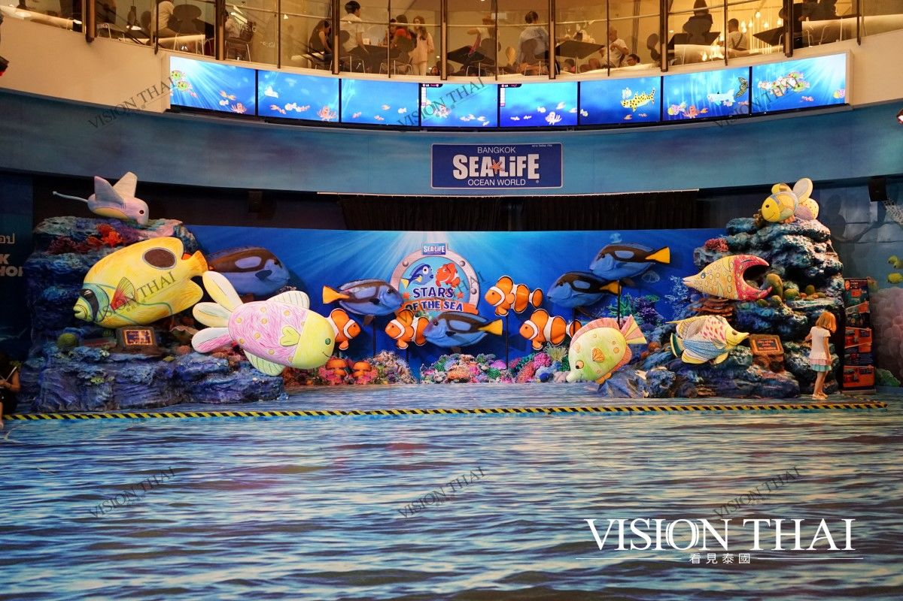

2025-暑假泰國五日遊
===

Time Table
---

Day1 
---
> [!IMPORTANT]
> :airplane: 機場 / :star:玉佛寺 / :shopping_cart:洽圖洽市集 / 逛夜市
> :hotel: 曼谷

> [!NOTE] 台北 - 曼谷 (星宇 - JX741 ) 
>> :clock3: 09:00 - 12:00 (航程 4小時)

出機場後，先到飯店Check-in放行李，

到市區有兩種選擇

    1. 包車 (不塞車的情況，約30-40分鐘)

[:link: 素萬那普國際機場接送＆交通](https://www.klook.com/zh-TW/airport-transfers/service/bkk-suvarnabhumi-airport/?spm=Home.SearchSuggest_LIST&clickId=e9c6a2adaf)

10人座

20人座

    2. 捷運
    曼谷機場快線（Airport Rail Link, ARL）終點站帕亞泰站（Phaya Thai）轉乘BTS（N2）線
    前往市中心 (目前ARL的票，好像要現場才能買，因為klook停賣了)
    全程大約需要30分鐘

[:link: 曼谷機場快線ARL Smart Pass](https://www.klook.com/zh-TW/activity/10027-bangkok-airport-rail-link-arl-ticket-bangkok-pass-bangkok/?aid=1061&utm_medium=affiliate-alwayson&utm_source=non-network&utm_campaign=1061&utm_term=)

[:link: 曼谷 BTS 空鐵兔子卡](https://www.klook.com/zh-TW/activity/11626-bts-skytrain-rabbit-card-bangkok/?spm=BlogArticle.InArticleActivity_LIST&clickId=1766f16dfd)

[:link: 曼谷 BTS 空鐵1日通票](https://www.klook.com/zh-TW/activity/10329-bangkok-sky-train-bts-one-day-pass-bangkok/?aid=1061&utm_medium=affiliate-alwayson&utm_source=non-network&utm_campaign=1061&utm_term=)

> [!TIP] 曼谷大皇宮/玉佛寺 或 臥佛寺
>> :clock3: 15:00 - 16:30 (停留 1小時30分鐘)

位於曼谷大皇宮內的玉佛寺為泰國扎克里王朝的御寺，正式名稱為拍西拉達那沙沙達蘭寺(Wat Phra Si Rattana Satsadaram)，因寺內供奉泰國國寶玉佛而得名玉佛寺。玉佛寺始建於1783年，由扎克里王朝的開國君主拉瑪一世下令修建，之後又經歷代國王修葺增建，匯集了多種泰國傳統宗教建築風格，可謂集泰國宗教文化與建築藝術之大成。

曼谷玉佛寺參觀重點 -  與舍利塔合影

臥佛寺是曼谷最古老也是最大的寺廟，以其豐富的佛像和雕刻聞名。寺內供奉著泰國排名前三的釋迦牟尼臥佛，壯觀程度令人驚嘆。

> [!TIP] 洽圖洽週末市集
>> :clock3: 17:00 - 19:00 (停留 2小時)

總面積約14公頃的加都加週末市場，是東南亞最大的週末市場，也是曼谷最熱門的觀光購物區。每個週末，這裡都湧進大批採購人潮，連本地人都大包小包地買不完。洽圖洽設有 15000個攤位，每天約有200,000位客人光顧。

半開放式的市場內部巷道縱橫，直走、拐彎、再回頭，又是不同的店家商區，遊逛起來別有趣味。市場大，商品種類也多，服飾、手工藝品、陶瓷器皿、傢俱擺設、古董、書籍以及二手服飾等都有。

> [!TIP] Jodd Fairs夜市(晚餐)
>> :clock3: 19:00 - 21:30 (停留 2小時30分鐘)

Jodd Fairs夜市(晚餐)

疫情期間，拉差達火車夜市曾一度關閉，令遊客大為失望。期後，拉差達火車夜市以全新面貌示人，並以新名字「JODD FAIRS RATCHADA夜市」面世。

全新JODD FAIRS夜市一改以往色彩繽紛的帳篷，而是統一以白色簡約色作主調，充滿文青風格。於2024年11月，JODD FAIRS Rama9夜市亦遷址至Ratchada重新亮相於人前!

---
Day2
---

> [!IMPORTANT]
> :star:鄭王廟/泰服體驗 / 暹邏百麗宮Siam Paragon / :shopping_cart:昭披耶河公主號遊船
> :hotel: 曼谷

> [!TIP] 鄭王廟/泰國傳統服飾 / 嘟嘟車遊曼谷?
>> :clock3: 09:00 - 13:00 (停留 4小時)

來到曼谷，怎能錯過被譽為「泰國埃菲爾鐵塔」的鄭王廟呢？這座美麗的廟宇也叫黎明寺，是昭披耶河畔最古老的建築之一。鄭王廟的裝飾華麗多彩，牆壁上繪滿了壁畫，有描繪宮廷生活的優雅場景，也有激烈戰爭的壯觀畫面，展現出細膩的工藝與美感。

黎明寺（鄭王廟）是泰國最大的舍利式塔，以其潔白莊嚴的外觀而聞名，位於昭披耶河畔，是明顯的地標，被網友稱為「泰國埃菲爾鐵塔」。寺內主殿「帕弘」（Phra Wihan）供奉著玉佛和釋迦牟尼佛像，金碧輝煌的裝飾令人目不暇接。

中央佛塔「普朗佩嘉」（Phra Prang）高達79米，設計獨特，底座和塔身呈方形，層數眾多。四周環繞著色彩各異的陪塔，展現出華麗的風貌。塔身鋪貼著彩色碎陶瓷，基座上繪有巨幅圖畫，並供奉風神。每層台階兩側則擺放著中國武士的石像，彰顯了文化的多樣性。

千萬別錯過登上中央佛塔的機會！攀爬陡峭的階梯後，您將能俯瞰整個曼谷舊城的美景，湄南河、大皇宮、臥佛寺等壯麗景觀一覽無遺，令人驚嘆不已。

[:link: 曼谷｜Sense Of Thai 傳統泰服租借](https://www.kkday.com/zh-tw/product/32106-thai-costume-rental-sense-of-thai-bangkok-package)

當你身著傳統泰服站在寺廟前，仿佛穿越了時空，融入了這片神聖的土地。穿著泰服，不僅是對當地文化的尊重，更是一種獨特的體驗。泰服的色彩斑斕，設計優雅，讓你在遊覽中增添了一份古典之美。

    ***是否要搭嘟嘟車或是搭捷運，可以討論

Tuk Tuk Hop 嘟嘟車套票
涵蓋超大曼谷市中區範圍，包括了 45 個接駁地點，東至金山寺、西至湄南河畔、南至唐人街、北至舊國會大廈，最主要的觀光景點如：大皇宮、臥佛寺、金佛寺、暹羅博物館、The Maharaj 等皆有抵達。不限次數任意搭乘，下載 App 請司機到定點接送，減少往返溝通的困擾！讓你輕鬆慢遊老城，不用走到鐵腿。

[:link: Tuk Tuk Hop 嘟嘟車套票](https://www.kkday.com/zh-tw/product/22372)

> [!TIP] 暹邏百麗宮Siam Paragon/曼谷海洋世界(午餐)
>> :clock3: 13:00 - 17:00 (停留 4小時)

在曼谷挑選一個必去的百貨公司，那麼位於暹羅商圈的《 Siam Paragon 暹羅百麗宮》百貨絕對是首選，你在台灣有看過那一家百貨公司同時存在電影院、保齡球場與海洋世界水族館嗎？《Siam Paragon 暹羅百麗宮》不是有來自世界各地精品品牌與相當多的美食之外，更有可以玩的地方，不管是大人還是小孩都能滿足

當年耗資3500萬美金打造貴婦級百貨公司《Siam Paragon 暹羅百麗宮》，幾乎所有國際知名品牌都有進駐像是LV、Bvlgari或Coach等等，更扯的是竟然還有高檔名車的專櫃進駐，這是在台灣生活的我們很少見到的，美食的部份像是TWG、Paul、after you等等甜點餐廳下午茶都有。

SEA LIFE曼谷海洋世界（舊稱“暹羅海洋世界”）是東南亞最大的水族館，在這裡可以欣賞到30,000只海洋生物，跨越400多個海洋物種，最適合一家大小共度歡樂時光。

擁有400種異國情調的海洋生物，深入海洋的深處。觀看巨型太平洋章魚，這位傑出的保護色大師，與環境無縫融合。或者參觀水下隧道，欣賞小丑魚和獅子魚帶來的色彩爆炸。

[:link: 曼谷暹羅海洋世界](hhttps://www.kkday.com/zh-tw/product/2735-sea-life-bangkok-ocean-world-ticket)

> [!TIP] Asiatique夜市
>> :clock3: 17:00 - 19:30 (停留 2小時)

Asiatique河濱夜市

Asiatique 河濱碼頭夜市位於昭皮耶河畔，泰國最大的摩天輪和占地寬敞的露天商場很有美式氛圍，琳琅滿目的商店要逛起來得花上不少時間，像是曼谷包、手標牌泰式奶茶、泰式零食等，還能欣賞泰拳秀及人妖秀，是一個好逛好買的複合式景點

Asiatique原先為泰國五世皇於1900年所興建的碼頭，整修後於2012年重新開幕，保留了碼頭及倉庫的外觀，規劃為一區商業區，吸引了眾多特色商家及餐飲業者進駐。
河畔夜市有座摩天輪，是Asiatique The Riverfront的地標。

> [!TIP] 昭披耶河公主號遊船/Buffert
>> :clock3: 19:30 - 21:30 (停留 2小時)

搭乘昭披耶公主號遊船夜遊昭披耶河，欣賞河畔玉佛寺及大皇宮等曼谷歷史地標。當夜幕降臨，建築換上金碧輝煌的華麗夜裝，倒映在水面上更顯璀璨動人。航行途中，在船上享用豐盛美味的自助晚餐，各類美食佳餚吃到飽，令人大呼過癮！還有樂團現場演奏80、90年代經典歌曲，營造放鬆浪漫的氛圍。立即預訂超人氣曼谷夜遊活動，在遊船上感受與眾不同的曼谷夜景及用餐體驗！

海鮮種類五花八門，滿足海鮮控的挑剔味蕾。豐盛自助晚餐提供各式全球佳餚美饌，2小時用餐時間讓你大飽口福！

遊船路線帶你一路遊覽曼谷經典歷史地標

[:link: 昭披耶河公主號遊船-Klook](https://www.klook.com/zh-TW/activity/375-chao-phraya-princess-cruise-bangkok/)

[:link: 昭披耶河公主號遊船-kkday](https://www.kkday.com/zh-tw/product/2567-chao-phraya-princess-river-cruise-with-dinner-buffet-thailand)

---
Day3
---

> [!IMPORTANT]
> :star:塞福瑞野生動物園 :shopping_cart:巧克力村Chocolate Ville
> :hotel: 芭達雅

> [!TIP] 曼谷塞福瑞野生動物園(陸地/海洋)(午餐)
>> :clock3: 09:00 - 15:00 (停留 6小時)

在"Safari World"的開放公園中駕車穿越，近距離觀察許多野生動物，如斑馬、大象和長頸鹿。觀賞瀕危物種如白犀牛和黑熊在公園中繼續它們的例行活動。

與活潑的紅毛猩猩合影留念。觀看色彩繽紛的異國鳥類在鳥類表演中飛翔。與可愛的虎仔和小長頸鹿見面，有機會直接餵食這些動物。

在海洋公園（MARINE PARK）觀賞才華橫溢的海豚和海獅進行表演。驚嘆於海豚們合唱歌曲並在空中翻筋斗的表演。

走進西部荒野，觀賞好萊塢牛仔特技表演。看到牛仔和強盜在一個驚險刺激的表演中進行令人咋舌的冒險特技，適合全家觀賞。

在Safari World Bangkok體驗一番野性的冒險！

[:link: 塞福瑞野生動物園-kkday](https://www.kkday.com/zh-tw/product/9793-safari-world-bangkok-ticket)

[:link: 塞福瑞野生動物園-klook](https://www.klook.com/zh-TW/activity/81157-safari-world-bangkok-shared-and-private-transfer/)

> [!TIP] 巧克力村Chocolate Ville(晚餐)
>> :clock3: 15:30 - 19:30 (停留 4小時)

    巧克力村莊園下午4點才開始營業, 避免塞車，提前到，可以欣賞傍晚夕陽黃昏景色

Chocolate Ville是於2011年12月開幕的，可以說在泰國曼谷最夯的餐廳，看到Chocolate Ville裡面不是賣巧克力，裡面是大型歐式戶外庭園餐廳，有著濃濃的歐洲鄉村風情

Chocolate Ville餐點主要是以美式、義式與泰式食物為主，餐點價格也不會太貴，跟台灣一些主題式餐廳差不多，裡面佔地很大，有運河、燈塔、玻璃屋，在裡面用餐的感覺非常舒適，不只外國遊客多，當地泰國人也常來這邊消費用餐。

除此之外，還有遊行和煙火表演可以欣賞，另外還可以跟超萌水豚互動

[:link: 賽佛瑞野生動物園 & 朱古力鎮互動式一日遊](https://www.klook.com/zh-TW/activity/11057-safari-world-chocolate-village-day-trip-bangkok/)

全家人的行李怎麼帶，要想一下

[:link: 曼谷至芭提雅私人接送](https://www.klook.com/zh-TW/activity/14234-private-city-transfers-pattaya-bangkok/)

---
Day4
---

> [!IMPORTANT]
> :star:達雅海灘 / :star:芭達雅大象叢林保護區之旅 / :shopping_cart:Pattaya Terminal 21 購物廣場
> :hotel: 芭達雅

> [!TIP] 芭達雅海灘自由玩
>> :clock3: 09:00 - 12:00 (停留 3小時)

> [!TIP] 芭達雅大象叢林保護區之旅 (午餐比較晚吃，出發前要先吃點東西)
>> :clock3: 12:30 - 17:30 (停留 5小時)

被評為世上最好的大象保護區之一！不騎象、不表演，在自然環境中大象受到尊重及妥善照顧，歡迎大家用愛來認識牠們！

早年傳統上，泰國人會使用大象來幫助他們進行狩獵、伐木和其他工作。現在，大象不需要做這麼沉重的工作了，換成人們負責照顧大象的日常起居。

芭達雅大象叢林保護區提供各種活動和計劃，讓遊客可以了解大象並與大象互動。這些活動像是：餵食、幫大象洗澡、陪大象一起散步、學習如何用大象便便做紙、認識大象的行為和保護…

    活動說明
    12:30  接駁車至飯店載客
    13:30  抵達體驗營＋認識大象和體驗營環境
    14:00  餵食大象＋與大象玩耍拍照
    14:45  幫大象洗澡＋做泥巴浴
    15:45  享用傳統泰式美食（自助式）＋學習製作「大象便便再生紙」
    16:30  離開體驗營（約 17.00-17.30 抵達住宿處）

[:link: 芭達雅大象叢林之旅-kkday](https://www.kkday.com/zh-tw/product/20126-elephant-friendly-half-day-experience-camp-in-pattaya-thailand)

[:link: 芭達雅大象叢林之旅-klook](https://www.klook.com/zh-TW/activity/8053-elephant-jungle-sanctuary-pattaya-experience/)

> [!TIP] Pattaya Terminal 21 購物廣場/ 飛機夜市 擇一 (晚餐)
>> :clock3: 17:30 - 21:00 (停留 3小時 30分鐘)

Terminal 21 Pattaya是泰國芭達雅極具規模的購物中心，在Terminal 21 Pattaya中集結了上百家店舖，從國際知名品牌到本地特色商品應有盡有。而且購物中心的建築與環境設計靈感來自於世界各大城市的國際機場，每一層樓都以不同的城市為主題，穿梭之中彷彿走過了巴黎、東京、倫敦、義大利等地區，讓人彷彿置身於環遊世界的旅程中。除此之外，在Terminal 21 Pattaya還有多樣化的餐廳進駐，其中最受歡迎的是館內的美食街「PIER 21 美食街」，有各式且多樣化的平價美食進駐。

然後來Terminal 21 Pattaya記得一定要來手扶梯後方的服務台，這邊用手機掃描註冊，可免費領取小點心跟購物中心折扣券，消費滿額還有送小禮，滿千送泰國知名品牌草本聞香罐、滿3500泰銖送NaRaYa曼谷包，真的還不錯。

前往Terminal 21 Pattaya可以搭乘雙條車（Songthaew）或計程車前往最方便，每次搭乘20泰銖。

    樓層介紹
    倫敦樓層（M層）Supermarket / Fashion Barnd Name / Sport & Street Brand
    義大利樓層（1層）Health & Beauty / Bank / Mobile & Gadget
    東京樓層（2層）Urbanista Shop / Boutique & Cafe’ Restaurants
    舊金山樓層（3層）Food Court / Restaurants
    PIER 21 美食街

芭達雅飛機夜市 Runway Street Food

飛機夜市位於芭達雅市區，靠近主要旅遊景點，交通便利，是當地居民和遊客夜晚消遣的熱門去處。最大特色是其中央停放的一架大型飛機，這架飛機不僅成為夜市的地標，還為整個夜市增添了獨特的氛圍。

此外，夜市的設計也充分利用了飛機跑道的概念，每個攤位擺放的排列有序，還有舒適且寬敞的用餐區及垃圾桶的設置，讓人逛夜市的同時彷彿在逛一個航空主題市集！

芭達雅飛機夜市 美食推薦：泰國經典與獵奇美食大集合

鱷魚肉：別騙我這是雞肉！整隻鱷魚像烤乳豬一樣登場超震撼

炸昆蟲是泰國街頭小吃中的一大特色，種類繁多，包括蝗蟲、蠍子、蟋蟀、蜘蛛甚至還有蜈蚣等，光想就覺得不可思議！對於初次嘗試的人來說，炸昆蟲可能是一種挑戰，因為視覺畫面就相當具有衝擊感。但這些昆蟲經過油炸後，外皮酥脆，內裡鮮嫩，通常會撒上鹽和辣椒粉增添風味。據說其獨特的口感和鹽酥雞差不多，而且昆蟲富有高蛋白質含量，如果願意一試，或許會愛上？

---
Day5
---

> [!IMPORTANT]
> :star:芭達雅羅摩衍那水上樂園 :airplane: 機場

> [!TIP] 芭達雅羅摩衍那水上樂園 (午餐) (營業時間 11:00–18:00)
>> :clock3: 09:00 - 14:00 (停留 5小時)

在泰國最大的水上樂園——羅摩衍那水上樂園，全家人都能暢享一整天的無限樂趣。該樂園佔地184,000平方米，規模令人驚歎。 自2016年5月5日開放以來，它已深受當地居民和遊客的喜愛。 羅摩衍那水上樂園在貓途鷹網站上排名泰國第一、亞洲第三，並躋身全球二十佳水上樂園之列。 除了驚險刺激的水上滑梯，園內還提供各種獨特設計的活動和一流的設施，定能讓每位遊客盡情玩樂，享受極致體驗！ 因此，請提前預訂門票，避免在芭提雅的炎炎烈日下排長隊。 不如直接去AquaSplash盡情戲水，在漂流河中感受間歇泉和瀑布的清涼，在清澈見底的泳池中放鬆身心，或是在著名的AquaDrop體驗心跳加速的刺激！ 芭提雅市中心以南僅15公里，水上樂園坐落在風景秀麗的環境中，靠近考芝燦佛山和銀湖葡萄園等著名景點，方便您遊玩後順道觀光。

羅摩衍那水上樂園擁有21個獨一無二的水滑梯，帶給您難忘的水上冒險體驗。

嘗試更輕鬆的遊樂設施，例如懶人河，在陽光下享受所有樂趣後放鬆一下。

[:link: 芭達雅羅摩衍那水上樂園門票-kkday](https://www.kkday.com/zh-tw/product/20225-ramayana-water-park-pattaya-ticket)

[:link: 芭達雅羅摩衍那水上樂園門票-klook](https://www.klook.com/zh-TW/activity/2322-ramayana-water-park-pattaya/)

> [!TIP] 前往素萬那普國際機場
>> :clock3: 14:00 - 15:30 (交通時間 1小時30分鐘)

[:link: 素萬那普國際機場接送＆交通](https://www.klook.com/zh-TW/airport-transfers/)

> [!NOTE] 曼谷 - 台北 (星宇 - JX746 ) 
>> :clock3: 17:50 - 22:40 (航程 4小時)

[:link: 2025暑假泰國五日遊](hhttps://www.google.com/maps/d/u/0/edit?mid=17LaeuNX8RLTC9kHb4YlEfU4K7ahct8w&usp=sharing)

---
泰國與台灣
---

泰國的面積比台灣大約14倍 ，人口也多了近5倍。經濟方面，台灣的人均GDP較高，而宗教信仰方面，兩國皆以佛教為主，但泰國的佛教信仰比例更高。
(曼谷比新北市略小)
| 項目   | 台灣       | 泰國       |
|--------|-----------|-----------|
| **面積** | 約36,193平方公里 | 約513,120平方公里 |
| **人口** | 約2,300萬人 | 約7,180萬人 |
| **所得 (人均GDP)** | 約32,000美元 | 約7,448美元 |
| **首都** | 台北 | 曼谷 |
| **幣別** | 新台幣 (TWD) | 泰銖 (THB) |
| **宗教** | 主要為佛教、道教 | 主要為佛教 (約93.5%)，其次為伊斯蘭教 (約5.32%) |

    語言

| 項目       | 泰文                          | 中文                          |
|-----------|------------------------------|------------------------------|
| **字母 vs. 字形** | **44 個子音字母**、**15 個母音符號**，有聲調符號 | **漢字**，象形或表意符號，無字母系統 |
| **書寫方式** | 不分詞，句子中的單字通常連在一起 | 每個字獨立，單詞之間有明顯分隔 |
| **語法結構** | 孤立語，沒有動詞變化，語法相對簡單 | 孤立語，但有較多語法規則，如量詞、語序等 |
| **聲調** | **五種聲調**（高、中、低、升、降） | **四種聲調**（陰平、陽平、上聲、去聲） |
| **字體風格** | 標準體、黑體，某些字母在不同字體下形狀差異大 | 宋體、楷體、黑體，字形變化較小 |

    地理 
泰國面積約五十萬平方公里，與法國國土相若，人口約六千餘萬。 一般大眾習慣將泰國的疆域比作大象的頭部，將北部視為「象冠」，東北地方代表「象耳」，暹羅灣代表「象口」，而南方的狹長地帶則代表了「象鼻」。
泰國大部分地區屬於熱帶季風氣候，常年氣溫在19~38 ℃之間，平均氣溫約 28 ℃，平均年降雨量約1000毫米，可說是一年四季都很適合旅遊。
遊客可以在境內不同的地區享受不同的旅遊形式。泰國有現代化的城市曼谷，南部面臨暹羅灣和印度洋，有很多天然的沙灘度假區發展起來，北部山區氣候宜人，亦適宜旅行。

    語言
泰國的官方語言是泰語，是大多數泰國人的母語。此外，英語也廣泛被使用，尤其是在旅遊業和商業領域。泰國語言的多樣性反映了該國多元的文化背景，也方便了國內外人士的溝通和交流。

    特產
泰國是一個擁有豐富特產的國家，以其獨特的農產品和水產品聞名於世。其中包括世界知名的泰國香米、各種多汁的熱帶水果如榴槤、芒果、椰子，以及豐富的海鮮資源和多樣的香料，這些特產豐富了泰國的飲食文化，也是旅客前往泰國的一大魅力所在。

泰語的主要子音字母及其發音與例詞
| 字母 | 發音 | 例詞 |
|------|------|------|
| ก   | g/k  | ไก่ (gài, 雞) |
| ข   | kh   | ขวด (khùat, 瓶子) |
| ค   | kh   | ควาย (khwāi, 水牛) |
| ง   | ng   | งู (ngū, 蛇) |
| จ   | j    | จาน (jān, 盤子) |
| ฉ   | ch   | ฉัน (chǎn, 我) |
| ช   | ch   | ช้าง (chāng, 大象) |
| ซ   | s    | ซอง (sōng, 信封) |
| ด   | d    | ดิน (din, 土) |
| ต   | t    | ต้นไม้ (tôn mái, 樹) |
| ท   | th   | ทะเล (thalē, 海) |
| น   | n    | น้ำ (nám, 水) |
| บ   | b    | บ้าน (bân, 家) |
| ป   | p    | ปลา (plā, 魚) |
| พ   | ph   | พ่อ (phô, 父親) |
| ฟ   | f    | ฟ้า (fá, 天空) |
| ม   | m    | แมว (māo, 貓) |
| ย   | y    | ยิ้ม (yím, 微笑) |
| ร   | r    | รถ (rót, 車) |
| ล   | l    | ลิง (ling, 猴子) |
| ว   | w    | วัน (wan, 天) |
| ศ   | s    | ศาลา (sālā, 涼亭) |
| ส   | s    | สวย (sǔai, 美麗) |
| ห   | h    | หมา (mǎ, 狗) |
| อ   | ʔ    | อาหาร (ʔāhān, 食物) |
| ฮ   | h    | ฮา (hā, 笑) |

